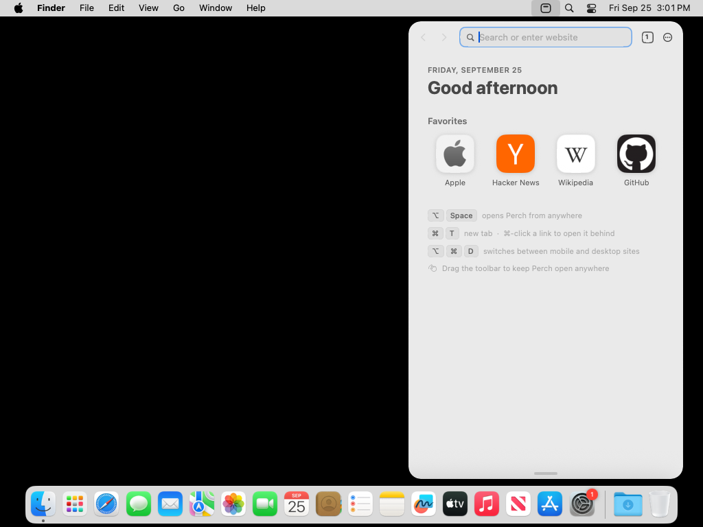
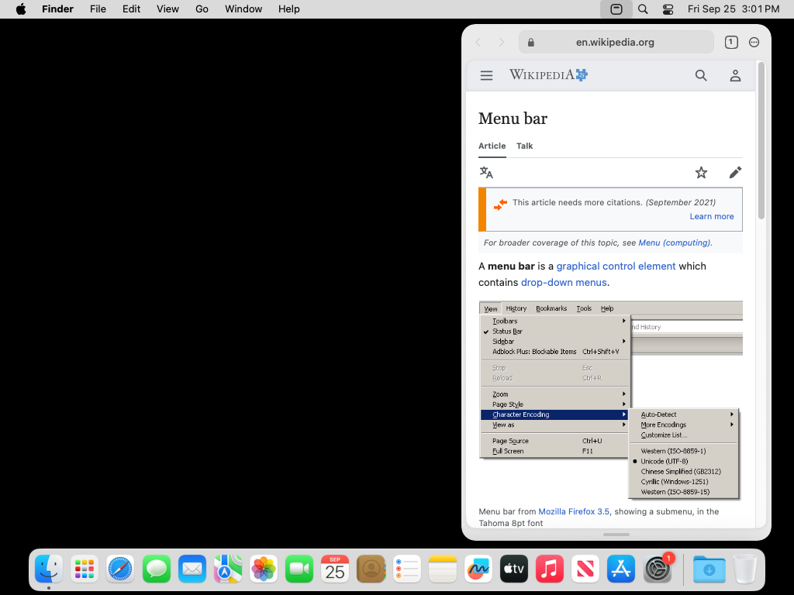
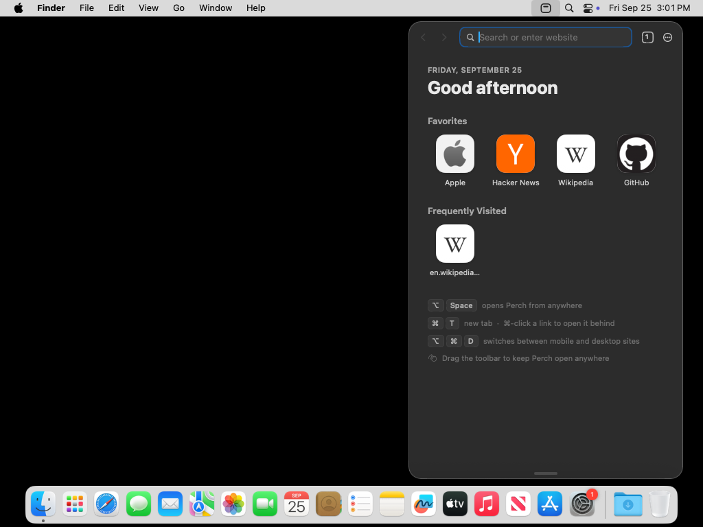
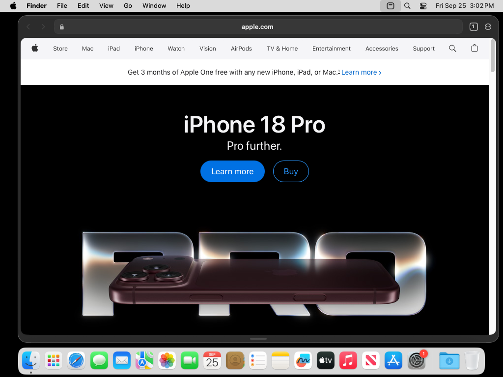

# Perch

**A browser that lives in your menu bar.**

Click the little window in the menu bar, or press **⌥ Space** from any app, and a
page drops down on a pane of glass. Press **Escape** and it's gone, and you're
back where you were. No Dock icon, no window to lose, nothing in the way.

Perch is native Swift (AppKit + SwiftUI) running WebKit, the engine already built
into macOS. It's a few megabytes, not a few hundred.

<p>
  
  
</p>
<p>
  
  
</p>

<sub>Screenshots are taken by CI on every push (see <code>.github/workflows/build.yml</code>).</sub>

## What it does

- **Always one keystroke away.** A global shortcut (⌥Space by default, change it
  in Settings) shows and hides Perch from anywhere, even over full-screen apps.
  Focus goes back to the app you came from when it closes.
- **One field for everything.** Type an address or a search. Suggestions come
  from your history, your favorites and your search engine. A *Top Hit* is picked
  when what you're typing is clearly a site you've visited. ⌘-Return opens it in a new tab.
- **Sized for a menu bar.** Pages use their **mobile layout** while the panel is
  phone-width and their desktop layout when it's wider (⌥⌘D flips it for one tab).
  Drag the grip at the bottom to resize. Double-click it, or press ⌃⌘1/2/3, to jump
  between Phone, Tablet and Desktop sizes.
- **Keep it open, anywhere.** Drag the toolbar and the panel lifts off the menu
  bar and stays where you drop it, open even while you work in other apps.
  Double-click the toolbar to dock it again.
- **Tabs like Safari on iPhone.** The count button shows every tab as a card with
  a live snapshot. ⌘T, ⌘W, ⇧⌘T, ⌘1–9, ⌃Tab, and ⌘-click or middle-click to open links
  behind.
- **A start page worth landing on.** The date, a greeting, your favorites (drag
  to reorder) and the sites you visit most, with real site icons.
- **Private tabs** (⇧⌘N) keep their own cookies, never touch history, and forget
  everything when the last one closes.
- **Ads and trackers blocked** before they load, using WebKit's content blocker.
- Find on page, zoom, downloads to ~/Downloads, share, copy link, open in your
  default browser, alerts as sheets, file uploads, camera and mic prompts, swipe
  back and forward, session restore, launch at login, light/dark/system
  appearance. Perch can also be your default browser.

## Build

Requires macOS 14 or later and the Xcode command line tools.

```sh
./build.sh           # → build/Perch.app (release, ad-hoc signed)
open build/Perch.app
```

`./build.sh release zip` also writes `build/Perch.zip`. Set `PERCH_SIGN_IDENTITY` to
sign with your Developer ID. Every push is built on GitHub Actions and the zipped
app is attached to the run.

For a quick loop while developing: `swift run`. (It runs without an app bundle,
so there's no icon, and launch at login and default-browser settings won't take.)

## Keyboard

| | |
|---|---|
| ⌥Space | Show / hide Perch (configurable) |
| ⌘L | Address field |
| ⌘T / ⇧⌘N | New tab / new private tab |
| ⌘W / ⇧⌘T | Close tab / reopen closed tab |
| ⇧⌘\\ | All tabs |
| ⌘1…⌘9, ⌃Tab, ⇧⌘] / ⇧⌘[ | Switch tabs |
| ⌘[ / ⌘] / ⌘R | Back / forward / reload |
| ⌘F, ⌘G | Find on page |
| ⌘D | Add to favorites |
| ⇧⌘C | Copy link |
| ⌘+ / ⌘− / ⌘0 | Zoom |
| ⌥⌘D | Request desktop or mobile site |
| ⌥⌘P | Keep open |
| ⌃⌘1 / 2 / 3 | Phone / Tablet / Desktop size |
| Esc | Close the find bar, the tab grid, or the panel |

Right-click the menu bar icon for a quick menu. ⌥-click it to open straight
into a new tab.

## Layout

```
Sources/Perch/
  App.swift          entry point, menu bar item, hot key wiring, login item
  Panel.swift        the glass panel: showing, hiding, anchoring, resizing, detaching
  Browser.swift      tabs, navigation, session, toasts, downloads
  Tab.swift          one WKWebView and its delegates
  RootView.swift     toolbar, page card, find bar, grip, toasts
  Omnibox.swift      the address field and its suggestions
  StartPage.swift    new tab page
  TabOverview.swift  the grid of tabs
  SettingsView.swift settings and the shortcut recorder
  Commands.swift     main menu (for shortcuts) and the ⋯ menu
  History.swift      history, favorites, site icons, storage
  Prefs.swift        preferences, search engines, user agents, key combos
  HotKey.swift       system-wide shortcut via Carbon
  Blocker.swift      content blocking rules
  Design.swift       metrics, motion, shared little views
Icon/icon.swift      draws the app icon at build time
```

## Thanks

Inspired by [driceroland/Search](https://github.com/driceroland/Search), a small,
fast WebKit browser for the Mac, and by the menu bar and notch browsers built on top
of it.
